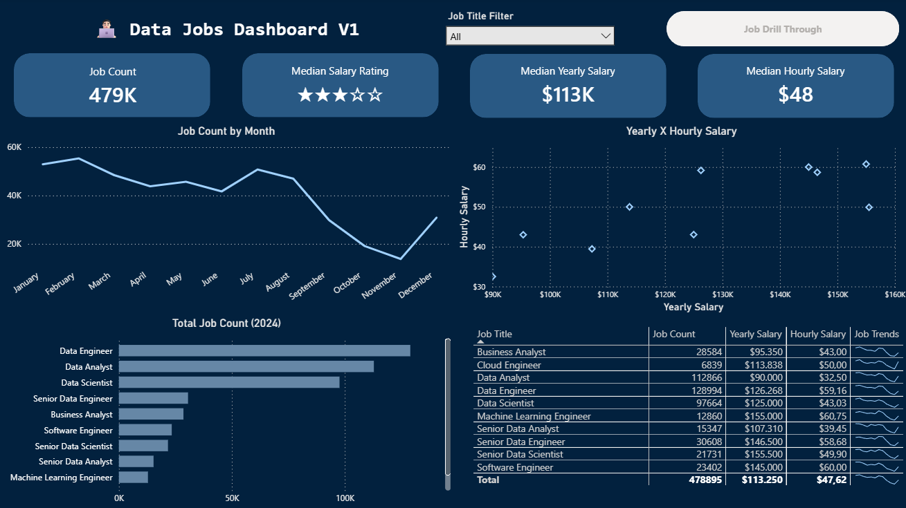
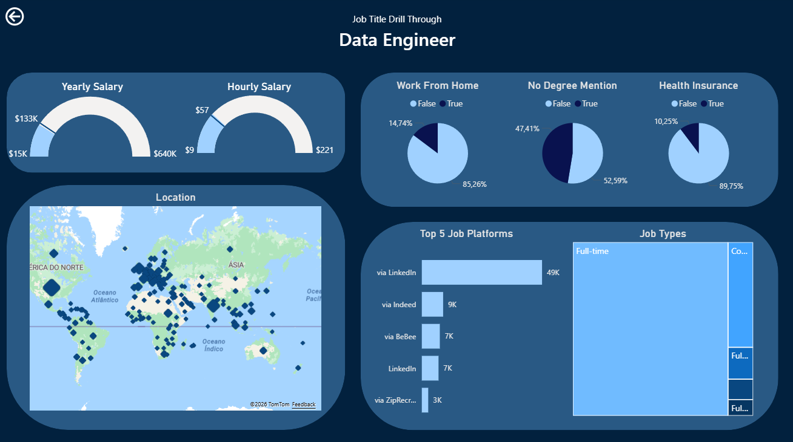

# Data Jobs Analysis - V1

## Overview
A dashboard created utilizing a 2024 dataset that aims to answer questions about data jobs in general, with insights on location, salary, job posting platform and schedule. \
With an easy-to-use interface, it is possible to navigate between two pages, one with more general information regarding the job postings, and another with more in-depth information regarding each job position.

## Dashboard Overview

**Page 1: General Overview**

It showcases key KPIs such as total job count, median salaries, top job titles, along with other charts to give more information on the data job market.

**Page 2: Job Drill Through**

From the main dashboard, you can drill through to this view to get specific details for a single job title, including salary ranges, work-from-home stats, top hiring platforms, and a global map of job locations.

## Technical Details

- **Data Transformation and Preparation (ETL)**

Use of Power Query for data cleaning and structuring, including handling null values, adjusting data types, and creating new columns to enrich the analysis.

- **Modeling and Metric Creation**

Development of implicit measures to generate relevant insights and KPIs, such as average annual salary and number of job openings.

- **Data Visualization and Analysis**

Construction of various charts (column, bar, line, and area) for trend analysis over time, as well as maps for geographic visualization and tables/cards for detailed information.

- **Dashboard Design and Interactivity**

Creation of an intuitive and visually appealing dashboard, with interactive features such as slicers, buttons, bookmarks, and drill-through, allowing dynamic navigation and in-depth data exploration.